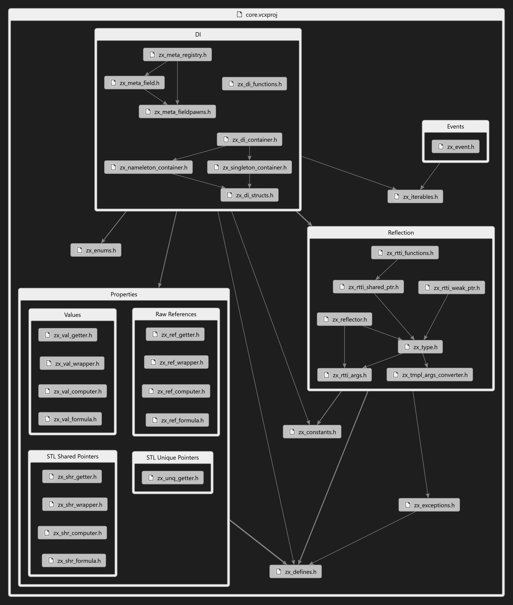

ZX Booster
==========

C++ booster. Dependency Injection, properties, delegates, reflection. 

The main intentions of this library are:
- Forward features of languages such C# in C++, 
- Enrich functionality of language with inversion of control via modern Dependency Injection approach. It will help to solve Law of Demeter with injected dependency abstractions not via constructors, yet via injection container. 

Brief Overview
--------------

If you are not familiar with all these missing in C++ language features, then I recommend you to jump to [Deeper Overview](#deeper-overview) section below in this document. 

### Properties

```c++
class property_user
{
	std::unique_ptr<dependency> 	_dependency;
	std::unique_ptr<owned>      	_owned;

public:
	zx::unq_getter<dependency> dependency = &_dependency;
};

// client code:
property_user u;
u.dependency->do_something();
u.dependency = ..; // forbidden

// or
class circle
{
	float _radius;
	float _cached_area;

public:
	zx::val_wrapper<circle, float> radius =
	{
		this, &_radius,

		[](circle& user, const float& value)
		{
			user._radius = value;
			_cached_area = pi * pi * _radius;
		}
	};  
};
```

### Delegates and Events

```c++
class cargo, location;

// Event provider (observer, dispatcher)
class cargo_dispatcher
{
	zx::multicast_delegate<void(const cargo&, const location&)> _cargo_arrived
public:
	zx::event<void(const cargo&, const location&)> cargo_arrived = _cargo_arrived;

private:
	void watch_loop()
	{
		while (_is_running)
		{
			if (is_there_new_cargo)
			{
				auto cargo = get_arrived_cargo();
				auto where_from = get_department_location();

				_cargo_arrived(cargo, where_from);
			}
		}
	}
}

// Event consumer (performer)
class unloader
{
	unloader(const cargo_dispatcher& dispatcher)
	{
		dispatcher.cargo_arrived += on_cargo_arrived;
	}

	void on_cargo_arrived(const cargo&    cargo, 
						  const location& where_from)
	{
		if (is_trusted_location(where_from))
		{
			unload(cargo);
		}
	}
}
```

### Reflection

```c++
//
// Example 1. Instance of reflected type. 
//

// Default ctor will be added to registry of zx::type
// if type is default constructible. 
zx::type some_type = zx::type::i<some_t>();

// Ensure all non-default ctors you need. Manually :(
zx::refl<some_t>::ctor<ctor_arg_t>::ensure();

// Client code...
auto some_instance = std::unique_ptr<some_t>(some_type.instantiate(ctor_arg));

//
// Example 2. Reflected smart pointers. 
//

// Templated one. 
auto shr1 = std::make_shared<some_t>();

// Reflected one. 
zx::rtti::weak_ptr rtti_wpt = shr1;
zx::type inferred_type = rtti_wpt.get_type();
inferred_type == some_type; // true

// And vice versa. 
std::shared_ptr<some_t> shr2 = rtti_wpt;
```

### Dependency Injection

```c++
void test_di_container::bind_all()
{
	bind_singleton<interface_to_inject, type_to_inject>(singleton_arg);
	bind_nameleton<type_to_inject>("instance 1", nameleton1_arg);
	bind_nameleton<type_to_inject>("instance 2", nameleton2_arg);

	register_signal_pack<test_signal_pack>();
}

class some_injectee
{
	// ...
	std::shared_ptr<interface_to_inject> _interface_inst;
	// ...
};

some_injectee::ctor::ctor()
{
	zx::meta::registry::add_field(
		nameof(_interface_inst),
		&some_injectee::_interface_inst,
		zx::make_fieldpawn_of_singleton());
}

some_injectee::some_injectee()
{
	zx::inject_dependencies(this);
}

void some_injectee::do_something()
{
	_interface_inst->do_something();
}
```

<br>
<br>

Deeper Overview
---------------

Each following section will consider every dedicated missing language/framework feature in C++/STL. For simplicity, we will start with comparison to existing language solutions, describe known problems and try to supply graceful replacement. 




Properties
----------

Properties are get & set method pairs to encapsulate data. 
They look like this in C#: 

```c#
public class Circle
{
	// Fields:
	float _radius;
	float _cachedCircumference;
	float _cachedArea;
	private readonly ShapeDispatcher _dispatcher;
	private readonly CircleDrawer _drawer = new();

	// Read only properties,
	// to deprecate reference reseat:
	public ShapeDispatcher Dispatcher => _dispatcher;
	public CircleDrawer Drawer => _drawer;

	// Read-write property:
	public float Radius
	{
		get => _radius;
		set 
		{
			PreActionIfNeeded();
			_radius = value; 
			_cachedCircumference = 2 * pi * _radius;
			_cachedArea = pi * pi * _radius;
			PosActionIdNeeded();
		}
	}

	Circle(ShapeDispatcher dispatcher)
	{
		_dispatcher = dispatcher;
	}
}

// Usage
var circle = new Circle();
circle.Radius = 10.0f;
```


This funcionality of C# has a lot of critique because in real life sometimes things go different. We actually not often have permissions to get or set something in pair or even at least one  of them.  

For example,

```c++
class cargo
{
	lib::weight _weight;

public:
	// Yes, we can obtain current amount of weight. 
	// But, sometimes, may be forbidden. 
	lib::weight weight() const { return _weight; }
	// (Another naming convention, the same stuff)
	lib::weight get_weight() const { return _weight; }

	// Leverage encapsulated data
	void load(lib::weight amount);
	void unload(lib::weight amount);

	// Looks strange, right?
	void set_weight(lib::weight value);
};
```

But, from another hand, this use case may be justified. Consider class `Circle` from above example:

```c++
class circle
{
	float _radius;
	float _cached_circumference;
	float _cached_area;
	...

public:
	...

	float radius() const { return _radius; }

	void set_radius(float value)
	{
		// It is not just only about set new value. 
		// Do not treat it verbatim, look: 
		pre_action_if_needed();
		_radius = value;
		_cached_circumference = 2 * pi * _radius;
		_cached_area = pi * pi * _radius;
		pos_action_if_needed();
	}
};
```

Conceptually zx will mirror it like this:

```c++
class property_user
{
	std::unique_ptr<dependency> 	_dependency;
	std::unique_ptr<owned>      	_owned;

public:
	zx::unq_getter<dependency> dependency = &_dependency;
};

// client code:
property_user u;
u.dependency->do_something();
u.dependency = ..; // forbidden

// or
class circle
{
	float _radius;
	float _cached_area;

public:
	zx::val_wrapper<circle, float> radius =
	{
		this, &_radius,

		[](circle& user, const float& value)
		{
			user._radius = value;
			_cached_area = pi * pi * _radius;
		}
	};  
};
```

For details, look [under the hood](doc/properties.md). 

<br>

Delegates and Events
--------------------

Delegates (archaic: callbacks) are invented to notify (feedback to) notification receiver. 

For example, in C#, qualifiers _delegate_ and _event_ becomes a little messy in terms of C++, because delegates are types (signatures) of callback, yet events are instances of some delegate, i.e. callbacks with subscription/unsubscription functionality designed to be exposed in the class. Delegates are types (signatures) of events, they are multicasted by default. That means they may consume many subscribers to be notified. Both of them will look like this in C#: 

```c#
// Event of this delegate will
// receive Cargo and Location instances
// and return nothing. 
public delegate void CargoArrivedDelegate(Cargo cargo,
										  Location whereFrom);

// Observer
public class CargoDispatcher
{
	public event CargoArrivedDelegate CargoArrived;

	private void WatchCargo()
	{
		while (_isRunning)
		{
			if (isThereNewCargo)
			{
				var cargo = GetArrivedCargo();
				var whereFrom = GetDepartmentLocation();

				CargoArrived?.Invoke(cargo, whereFrom);
			}
		}
	}
}

// Notification consumer
public class Unloader
{
	public Unloader(CargoDispatcher dispatcher)
	{
		dispatcher.CargoArrived += OnCargoArrived;
	}

	private void OnCargoArrived(Cargo cargo,
								Location whereFrom)
	{
		if (IsTrustedLocation(whereFrom))
		{
			Unload(cargo);
		}
	}
}
```

In `zx` we can do it this way:

```c++
class cargo, location;

// Event provider (observer, dispatcher)
class cargo_dispatcher
{
	zx::multicast_delegate<void(const cargo&, const location&)> _cargo_arrived
public:
	zx::event<void(const cargo&, const location&)> cargo_arrived = _cargo_arrived;

private:
	void watch_loop()
	{
		while (_is_running)
		{
			if (is_there_new_cargo)
			{
				auto cargo = get_arrived_cargo();
				auto where_from = get_department_location();

				_cargo_arrived(cargo, where_from);
			}
		}
	}
}

// Event consumer (performer)
class unloader
{
	unloader(const cargo_dispatcher& dispatcher)
	{
		dispatcher.cargo_arrived += on_cargo_arrived;
	}

	void on_cargo_arrived(const cargo&    cargo, 
						  const location& where_from)
	{
		if (is_trusted_location(where_from))
		{
			unload(cargo);
		}
	}
}
```

> **NOTE**
> 
> `zx::event` and `zx::multicast_delegate` are move only (non-copyable) types, they prevent copy of delegates they use. You cannot copy instance of `zx::event` but you can do it explicitly for `zx::multicast_delegate` via `copy()` method call. It was designed to not to get a bummer like pretending subscriber calls resulted from implicit copy. 

Fore more information see unit test folder: [./core_test/eventtest](./core_test/eventtest/)

<br>

Reflection
----------

This feature is useful when we do not know type of object at runtime, but want to instantiate instance of it. 

This approach differ from C++ 11 RTTI where we have type inference but have not possibility to instantiate instance of inferred type out of the box. 

To understand better what do I mean, let's assume the following C# code: 

```c#
// 
// Service
// 
{
	void DoSomethingWithNewInstance(object instance)
	{
		if (instance is Person person)
		{
			// ...
		}
		else if (instance is ...)
		{
			// ...
		}
		else
		{
			throw new InvalidArgumentException(...);
		}
	}
}

// 
// Caller
// 
{
	// Here we do not know type of person at compile time. 
	// But it is known at runtime. 
	object? instance = Activator.CreateInstance(someType, arg1, arg2);

	if (instance != null)
	{
		DoSomethingWithNewInstance(instance);
	}
}
```

Similar code with zx will be mirrored like this: 

```c++
// 
// Service
// 
{
	void do_something_with_new_person(void* instance)
	{
		if (person = dynamic_cast<person_t*>(instance))
		{
			// ...
		}
		else if (something = dynamic_cast<some_t*>(instance))
		{
			// ...
		}
		else
		{
			throw std::invalid_argument(...);
		}
	}
}

// 
// Caller
// 
{
	// Here we do not know type of person at compile time. 
	// But it is known at runtime. 
	auto instance = some_type.instantiate(arg1, arg2);

	if (instance)
	{
		do_something_with_person(person);
	}
}
```

Of course, besides of that .NET/CLR reflection has possibility to obtain fields, methods, properties, attributes of a type, but most essential one is object creation. 

Since local implementation of so called reflection, (`zx::type` class and `zx::rtti` namespace) does not implement all these features, it also may be treated as "partially reflection" or extension of C++ 11 RTTI. Also, please do not confuse it with mirror paradigm. 

With understanding of performance issues of this approach, this feature provides more abstraction in different cases. For example, dependency injection, which local implementation *(`zx::di…`)* depends on it *(`zx::rtti`)*. 

Let's talk about it. 

Dependency Injection
--------------------

Many languages already have this feature in restricted mode. Passing arguments in constructor is already dependency injection. Even more, passing service abstractions in constructor is already almost all you need. The problem is if you want to detach a couple of dependencies from whole program, you may feel lot of pain. Constructor DI is brief and graceful enough but doesn't offer robust refactoring protection. 

For example, in C#/.NET stack, starting with .NET 5, Dependency Injection is becoming out of the box feature. Let's consider simple case with usage of it: 

```c#
// DI setup
public void ConfigureServices(IServiceCollection services)
{
    // ...
    services.AddSingleton     <ISomeInterface, SomeImplementation>();
    services.AddHostedService <MainLoop>();
    // ...
}

// Client code
public class MainLoop : BackgroundService
{
    private readonly ISomeInterface _instance;

    public MainLoop(ISomeInterface instance) => _instance = instance;

    protected override async Task ExecuteAsync(CancellationToken stoppingToken)
    {
		// ...
		_instance.DoSomething();
		// ...
    }
}
```

Similar code with `zx` will look like this: 

```c++ 
// DI setup
void some_di_container::bind_all()
{
	bind_singleton<i_some_interface_t, some_implementation_t>();
}

class main_loop
{
	// ...
	std::shared_ptr<i_some_interface_t> _interface_inst;
	// ...
public:
	main_loop() 
	{
		zx::inject_dependenies(this);
	}
};

main_loop::ctor::ctor()
{
	zx::meta::registry::add_field(
		nameof(_interface_inst),
		&some_injectee::_interface_inst,
		zx::make_fieldpawn_of_singleton());
}

// Client code
void main_loop::execute()
{
	_interface_inst->do_something();
}

```

For details, look [under the hood](doc/dependency_injection.md). 

<br>

Known Issues
------------

- `write_to` methods of `zx::rtti` smart pointers do not invoke delete in place of previous state. So, this operation defers until weak references becomes zeroed.

<br>

Coding and Naming Conventions
-----------------------------

See it [here](doc/coding_standards_and_naming_conventions.md). 

			